# NeuralToolRouter

A production-ready Python framework that optimizes Agentic AI architectures by separating **Tool Retrieval** (using a fine-tuned PyTorch embedding model) from **Parameter Extraction and Execution** (using a heavy LLM). This dramatically reduces context window bloat and latency.

**A blueprint for eliminating context bloat and reducing API latency.**

### 🚀 NeuralToolRouter: Scaling Agentic AI Architectures
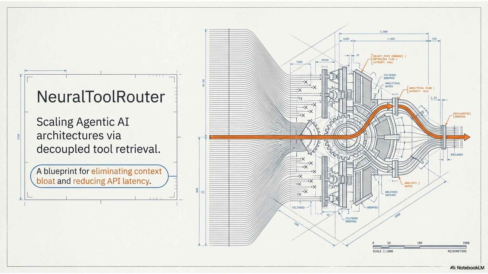

> "Welcome. This is NeuralToolRouter—a production-ready Python framework designed to solve one of the biggest bottlenecks in modern Agentic AI: scaling tool usage without blowing up your context window, latency, or API costs."

### ⚠️ The Bottleneck in Current Agentic AI
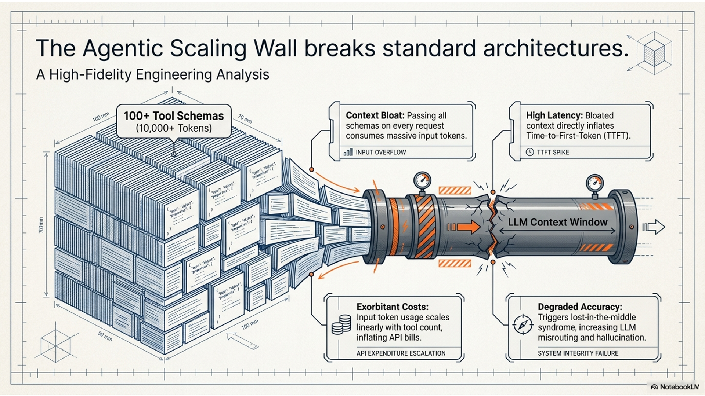

**The Challenge: Context Window Bloat:** 

Standard Agentic systems send **all** available tool schemas to the LLM on every single request. As your agent’s capabilities grow, this approach breaks down:
*   📈 **Context Window Bloat:** Passing 100+ complex JSON schemas per call consumes massive input tokens.
*   ⏳ **High Latency:** Larger context sizes directly increase the Time-to-First-Token (TTFT) and overall inference speed.
*   💸 **Exorbitant Costs:** Input tokens add up quickly, leading to heavily inflated API bills.
*   📉 **Degraded Accuracy:** LLMs suffer from "lost-in-the-middle" syndrome; exposing them to irrelevant tools increases hallucination and misrouting.

### 💡 The Solution - NeuralToolRouter
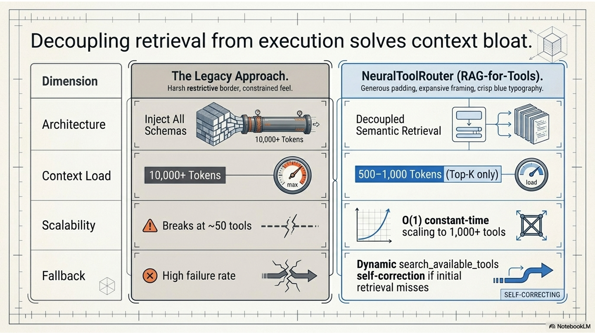

**Introducing a "RAG-for-Tools" Architecture:** 

NeuralToolRouter decouples **Tool Retrieval** from **Execution** by treating tool selection as a semantic search problem. 

*   **Fast Retrieval:** Uses fine-tuned PyTorch embedding models to fetch only the Top-K relevant tools.
*   **Query Expansion:** Employs a lightweight, fast LLM (e.g., GPT-4o-mini) to expand user intent before retrieval.
*   **Reduced Context:** Only the schemas for the Top-K retrieved tools are passed to the heavy "brain" LLM (e.g., GPT-4o).
*   **Dynamic Fallback:** The LLM retains a `search_available_tools` fallback function to self-correct if the right tool isn't initially found.

### 📊 Disruptive Performance Gains
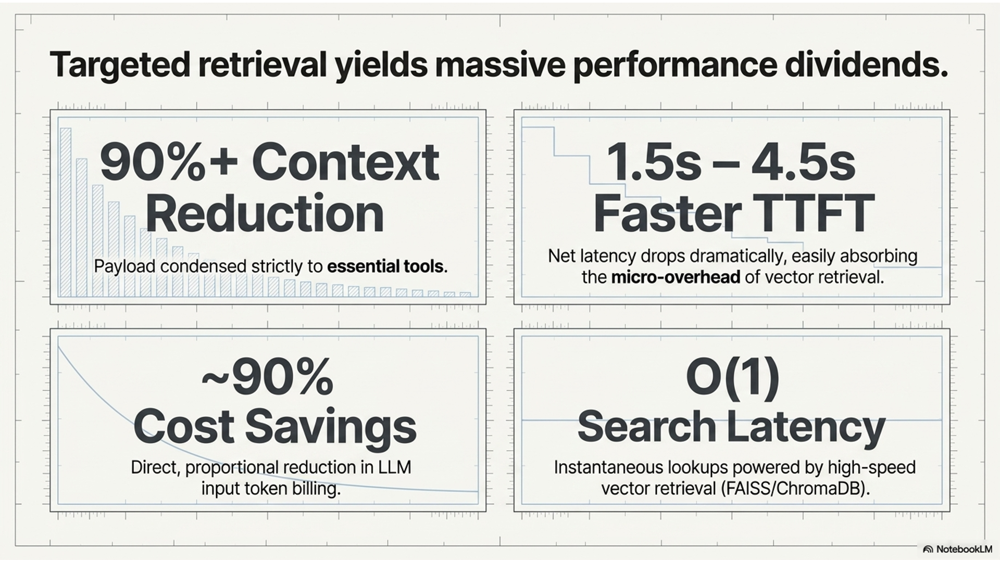

**Measurable ROI & Scalability:** 

By implementing NeuralToolRouter, AI architectures realize immediate, compounding benefits:
*   📉 **90%+ Context Reduction:** Condenses payload from 10,000+ tokens down to 500–1,000 tokens.
*   ⚡ **1.5 to 4.5s Faster Response:** Net latency drops dramatically despite the micro-overhead of the retrieval step.
*   💰 **~90% Cost Savings:** Token API costs shrink proportionally to the context reduction.
*   🌐 **Infinite Scalability:** Scales to 1,000+ tools with **O(1)** constant-time retrieval using FAISS/ChromaDB.

### ⚙️ Core Architecture Overview
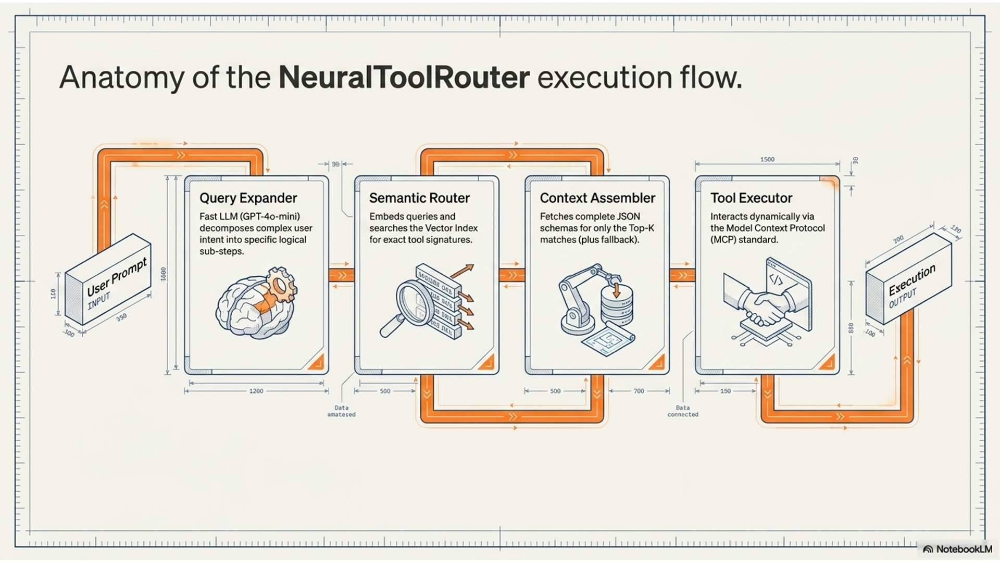

**How It Works Under the Hood:**

*   **Query Expander:** Breaks down the user’s prompt into specific logical sub-steps.
*   **Semantic Router:** Embeds the expanded queries and searches the Vector Index for relevant MCP tool signatures.
*   **Context Assembler:** Gathers the full JSON schemas for only the Top-K matching tools (plus the fallback tool).
*   **Tool Executor:** Executes the chosen tool through the open **Model Context Protocol (MCP)** standard.

### 🔄 Three-Phase Execution Strategy
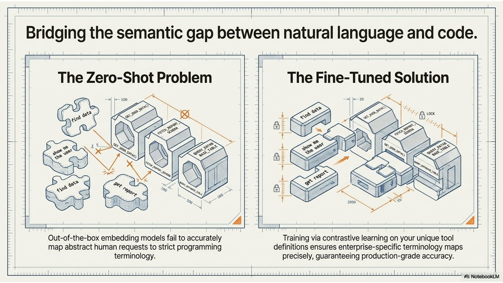

**Built for Production Readiness:** 

The framework operates in three distinct phases to ensure high accuracy:
1.  **Phase 1: Synthetic Data Gen (`main.py generate`)**
    *   Connects to your MCP servers to fetch schemas and uses a "Teacher LLM" to generate diverse synthetic user queries for your tools.
2.  **Phase 2: Model Fine-Tuning (`main.py train`)**
    *   Trains a lightweight embedding model (e.g., `all-MiniLM-L6-v2`) via contrastive learning on the synthetic data, then builds a FAISS/ChromaDB index.
3.  **Phase 3: Agentic Runtime (`main.py run`)**
    *   The live execution environment where hybrid retrieval (Semantic + BM25) routes user requests to the precise tool required.

> "Unlike zero-shot semantic search, NeuralToolRouter actually fine-tunes the embedding model specifically on your unique tool definitions. This ensures domain-specific terminology maps perfectly to the correct function."

### 🛠️ Bleeding-Edge Tech Stack
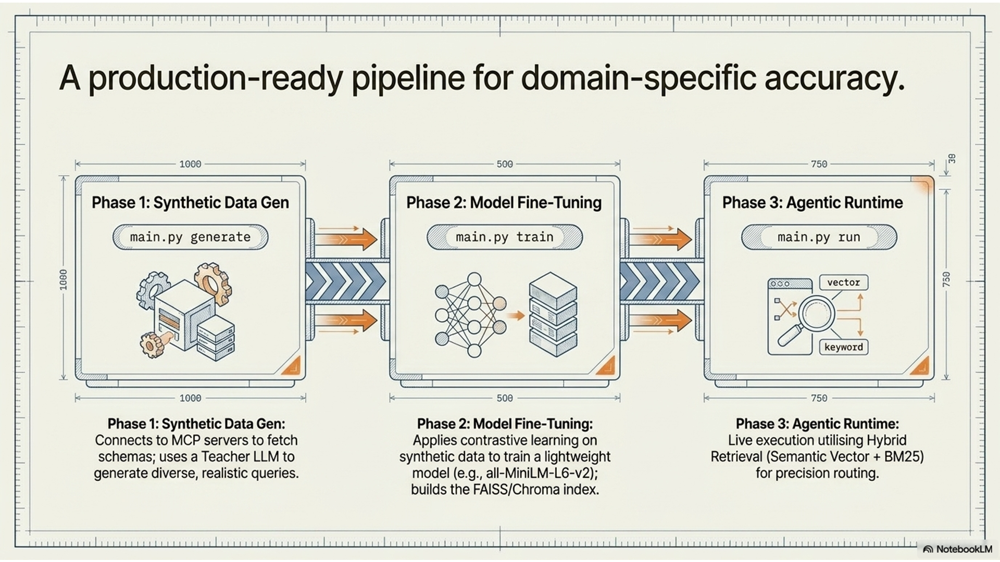

**Powered by Open Standards:** 

*   **Protocol:** Model Context Protocol (MCP) by Anthropic—standardizes how tools and data sources connect to AI models.
*   **Vector Infrastructure:** FAISS (for high-speed CPU/GPU retrieval) or ChromaDB.
*   **Embeddings:** `sentence-transformers` & PyTorch (CUDA-compatible for training).
*   **LLM Orchestration:** `LiteLLM` (allows seamless swapping between OpenAI, Anthropic, Google, and local models).

### 🎛️ Customization & Tuning
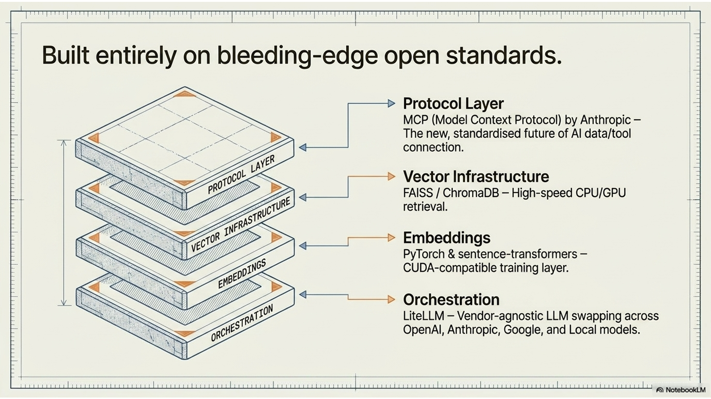

**Adaptable to Any Agentic Use Case:** 

NeuralToolRouter can be dynamically tuned based on your enterprise priorities:
*   🚀 **Optimize for Speed:** Swap to `paraphrase-MiniLM-L3-v2`, reduce Top-K to 2, disable query expansion, use `faiss-cpu`.
*   🎯 **Optimize for Accuracy:** Use `all-mpnet-base-v2`, increase Top-K to 5, train for more epochs, use Hybrid Retrieval (Vector + BM25).
*   💸 **Optimize for Cost:** Swap the Expansion LLM to open-source or `gpt-4o-mini`, minimizing cloud dependency.

### 🔌 Seamless Enterprise Integration
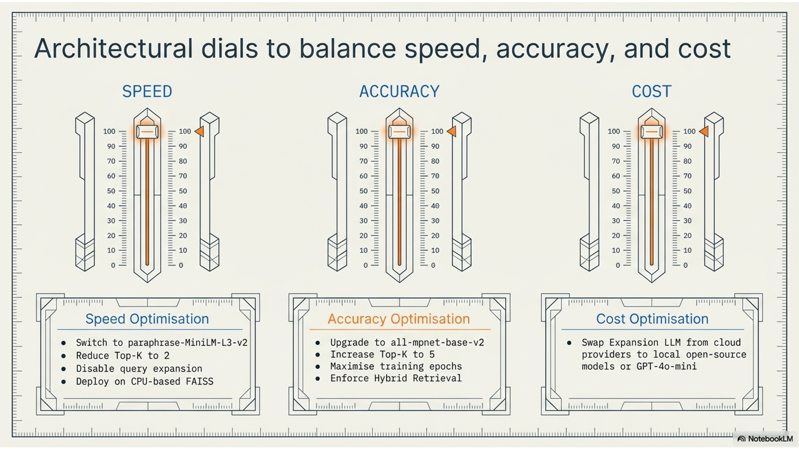

**Drop-in Replacement for Any Framework:** 

NeuralToolRouter is designed to bypass interactive runtime limitations. You can directly inject the generated FAISS/BM25 indices and fine-tuned embeddings into your existing orchestrators.
*   **Compatible Frameworks:** LangChain, AutoGen, IBM BeeAI, CrewAI.
*   **How it fits:** Replace your existing `ToolNode` or standard tool arrays with a `SemanticRouter.retrieve_tools()` call. Pass only the resulting schemas into your Agent's prompt context.

### 🎯 Conclusion & Next Steps
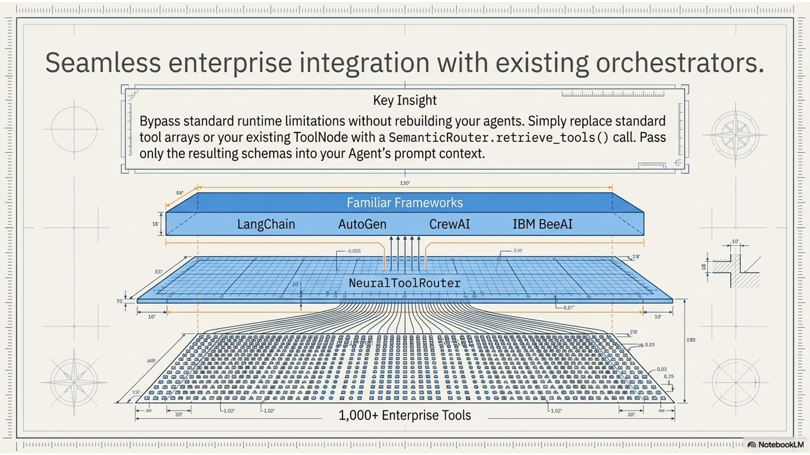

**Future-Proofing Your Agentic AI**

*   **The Paradigm Shift:** Moving from passing *all* tools to *dynamically retrieving* relevant tools is critical for scaling to hundreds of enterprise tools.
*   **Get Started:** 
    *   Clone the repository: `git clone https://github.com/sinny777/neural-tool-router`
    *   Review `ARCHITECTURE.md`
    *   Run the 3-phase pipeline setup
*   **Looking Ahead:** Active learning from user feedback, multi-modal routing, and hierarchical tool logic.

### 💡 Start integrating today
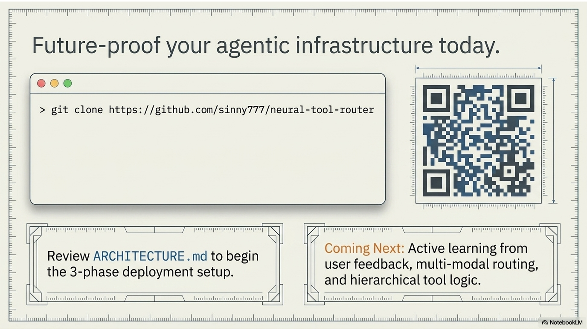

### SUMMARY

## 🎯 Problem Statement: The Agentic Scaling Wall

Standard architectures break when hitting the agentic scaling wall. Most Agentic AI systems suffer from:
- **Context Bloat**: Passing all schemas on every request consumes massive input tokens (e.g. 100+ tool schemas can equal 10,000+ tokens).
- **High Latency**: Bloated context directly inflates Time-to-First-Token (TTFT).
- **Degraded Accuracy**: Triggers "lost-in-the-middle" syndrome, increasing LLM misrouting and hallucination.
- **Exorbitant Costs**: Input token usage scales linearly with tool count, inflating API bills.

## 💡 Solution: Decoupling Retrieval from Execution

NeuralToolRouter implements a **RAG-for-Tools** architecture:

1. **Query Expander**: Fast LLM (GPT-4o-mini) decomposes complex user intent into specific logical sub-steps.
2. **Semantic Router**: Embeds queries and searches the Vector Index for exact tool signatures.
3. **Context Assembler**: Fetches complete JSON schemas for only the Top-K matches (plus fallback).
4. **Tool Executor**: Interacts dynamically via the Model Context Protocol (MCP) standard.
5. **Self-Correcting Fallback**: Dynamic `search_available_tools` fallback mechanism if initial semantic retrieval misses.

**Why Fine-tuning?**
Out-of-the-box embedding models fail to accurately map abstract human requests to strict programming terminology. Training via contrastive learning on your unique tool definitions ensures enterprise-specific terminology maps precisely, guaranteeing production-grade accuracy.

### 🚀 Performance Gains

Targeted retrieval yields massive performance dividends:
- **90%+ Context Reduction**: Payload condensed strictly to essential tools.
- **1.5s - 4.5s Faster TTFT**: Net latency drops dramatically, easily absorbing the micro-overhead of vector retrieval.
- **~90% Cost Savings**: Direct, proportional reduction in LLM input token billing.
- **O(1) Search Latency**: Instantaneous lookups scaling to 1,000+ tools powered by high-speed vector retrieval (FAISS/ChromaDB).


## 🏗️ Architecture

Built entirely on bleeding-edge open standards:
- **Protocol Layer**: MCP (Model Context Protocol) by Anthropic — The new, standardised future of AI data/tool connection.
- **Vector Infrastructure**: FAISS / ChromaDB — High-speed CPU/GPU retrieval.
- **Embeddings**: PyTorch & sentence-transformers — CUDA-compatible training layer.
- **Orchestration**: LiteLLM — Vendor-agnostic LLM swapping across OpenAI, Anthropic, Google, and Local models.

Seamless enterprise integration with existing orchestrators: Bypass standard runtime limitations without rebuilding your agents. Simply replace standard tool arrays or your existing ToolNode with a `SemanticRouter.retrieve_tools()` call. Pass only the resulting schemas into your Agent's prompt context.

See [`ARCHITECTURE.md`](./docs/ARCHITECTURE.md) for detailed architecture documentation including Mermaid diagrams, component descriptions, and extension points.

## 📊 Monitoring & Logging

Logs are written to `logs/runtime.log` with configurable levels:

```python
# In config.py
log_level: str = "INFO"  # DEBUG, INFO, WARNING, ERROR
```

Key metrics logged:
- Query expansion time
- Retrieval accuracy (Top-K hit rate)
- Tool execution success rate
- End-to-end latency

## 🧪 Testing

Test individual components:

```bash
# Test MCP client
python mcp_client.py

# Test configuration
python config.py
```

## 🔄 Updating Tools

When you add/remove MCP servers or tools:

1. Re-run Phase 1 to regenerate training data
2. Re-run Phase 2 to retrain the model
3. The vector index will be automatically updated

For minor tool changes, you can skip retraining and just rebuild the index:

```python
from tool_router.trainer import VectorIndexBuilder, load_tools_from_cache
from tool_router.config import config

# Load tools and model
tools = load_tools_from_cache(config.mcp.tool_cache_path)
model = SentenceTransformer(str(config.embedding.fine_tuned_model_dir))

# Rebuild index
builder = VectorIndexBuilder(model, config.vector_store)
builder.build_faiss_index(tools)
builder.save_faiss_index()
```

## 🎛️ Advanced Usage

### Custom Embedding Models

Swap the base model in [`config.py`](config.py):

```python
base_model_name: str = "sentence-transformers/all-mpnet-base-v2"  # Larger, more accurate
# or
base_model_name: str = "sentence-transformers/paraphrase-MiniLM-L3-v2"  # Smaller, faster
```

### Using ChromaDB Instead of FAISS

```python
# In config.py
store_type: str = "chromadb"
chromadb_path: Path = Path("./data/chromadb")
```

### Programmatic API

```python
from tool_router.runtime import ToolRouter
import asyncio

async def main():
    router = ToolRouter()
    await router.initialize()
    
    result = await router.process_query("What's the weather in SF?")
    print(result)
    
    await router.close()

asyncio.run(main())
```

### Using Artifacts in Custom Agentic AI Applications

You can completely bypass the `ToolRouter` interactive runtime and directly inject the generated FAISS/BM25 indices and fine-tuned embedding models into your own agent architectures (like LangChain, AutoGen, or IBM BeeAI):

```python
from tool_router.config import config
from sentence_transformers import SentenceTransformer
from tool_router.runtime import SemanticRouter

# 1. Load the fine-tuned embedding model
model = SentenceTransformer(str(config.embedding.fine_tuned_model_dir))

# 2. Initialize the Semantic Router with Hybrid Retrieval
semantic_router = SemanticRouter(model, config.vector_store)
semantic_router.load_faiss_index()
semantic_router.load_bm25_index()

# 3. Retrieve only the highly relevant tools for a specific sub-task
task = "Fetch the patient's hospital discharge summary"
top_tools = semantic_router.retrieve_tools(task, top_k=2, use_hybrid=True)

# 4. Map IDs back to schemas and pass ONLY these tools into your Agent!
# (See examples/beeai_mediclaim_processing/multi_agent_orchestrator.py for a complete example)
```

## 📈 Performance Tuning: Architectural Dials

Balance speed, accuracy, and cost with configuration dials:

### Speed Optimisation
- Switch to `paraphrase-MiniLM-L3-v2`
- Reduce Top-K to 2
- Disable query expansion
- Deploy on CPU-based FAISS

### Accuracy
- Upgrade to `all-mpnet-base-v2`
- Increase Top-K to 5
- Maximise training epochs
- Enforce Hybrid Retrieval (Semantic Vector + BM25)

### Cost Optimisation
- Swap Expansion LLM from cloud providers to local open-source models or GPT-4o-mini

## 🚀 Future-proof your agentic infrastructure today

**Coming Next:** Active learning from user feedback, multi-modal routing, and hierarchical tool logic.

---

## 🤝 Contributing

Contributions welcome! Areas for improvement:

- [ ] Active learning from user feedback
- [ ] Multi-modal tool descriptions (images, audio)
- [ ] Hierarchical tool routing
- [ ] Streaming results
- [ ] Web UI

## 📄 License

MIT License

Copyright (c) 2024 NeuralToolRouter Contributors

Permission is hereby granted, free of charge, to any person obtaining a copy
of this software and associated documentation files (the "Software"), to deal
in the Software without restriction, including without limitation the rights
to use, copy, modify, merge, publish, distribute, sublicense, and/or sell
copies of the Software, and to permit persons to whom the Software is
furnished to do so, subject to the following conditions:

The above copyright notice and this permission notice shall be included in all
copies or substantial portions of the Software.

THE SOFTWARE IS PROVIDED "AS IS", WITHOUT WARRANTY OF ANY KIND, EXPRESS OR
IMPLIED, INCLUDING BUT NOT LIMITED TO THE WARRANTIES OF MERCHANTABILITY,
FITNESS FOR A PARTICULAR PURPOSE AND NONINFRINGEMENT. IN NO EVENT SHALL THE
AUTHORS OR COPYRIGHT HOLDERS BE LIABLE FOR ANY CLAIM, DAMAGES OR OTHER
LIABILITY, WHETHER IN AN ACTION OF CONTRACT, TORT OR OTHERWISE, ARISING FROM,
OUT OF OR IN CONNECTION WITH THE SOFTWARE OR THE USE OR OTHER DEALINGS IN THE
SOFTWARE.

## 🙏 Acknowledgments

- Built on [Model Context Protocol (MCP)](https://modelcontextprotocol.io/)
- Uses [sentence-transformers](https://www.sbert.net/)
- Powered by [LiteLLM](https://github.com/BerriAI/litellm)

## 📞 Contributing & Support

Contributions are welcome! If you find this repository helpful, please star it!

<div align="center">
  <br>
  <p><b>Connect with me</b></p>
  <a href="https://x.com/gurvinder_777"></a>
  <a href="https://www.linkedin.com/in/gurvindersingh777/"></a>
  <a href="https://github.com/sinny777"></a>
</div>

For issues and questions:
- GitHub Issues: [[NeuralToolRouter](https://github.com/sinny777/neural-tool-router/issues)]
- Documentation: [`ARCHITECTURE.md`](./docs/ARCHITECTURE.md)

**Built with ❤️ for the Agentic AI community by [Gurvinder Singh](https://github.com/sinny777)**