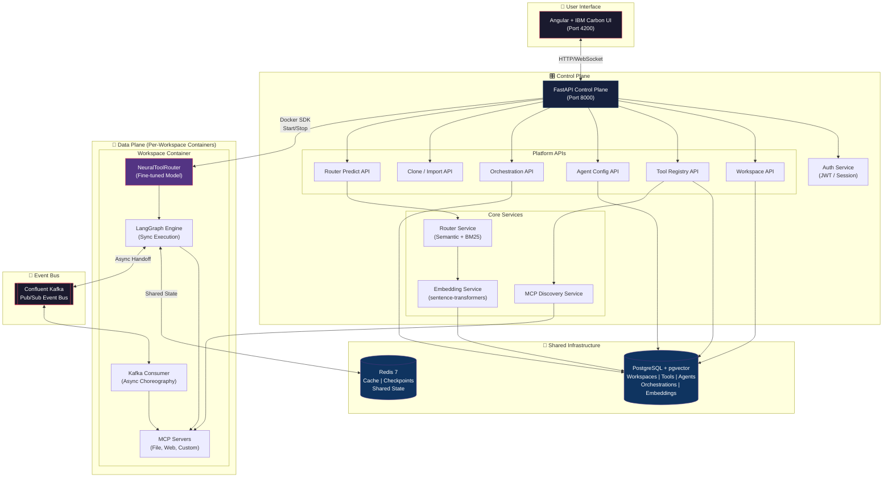
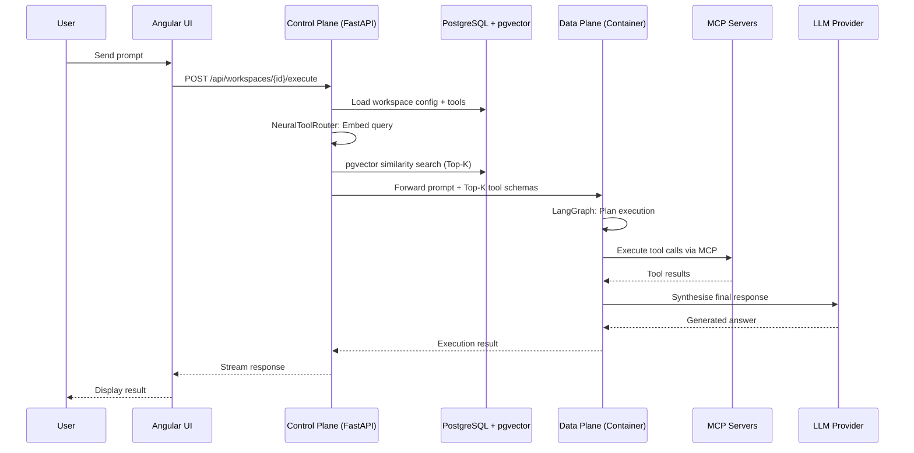
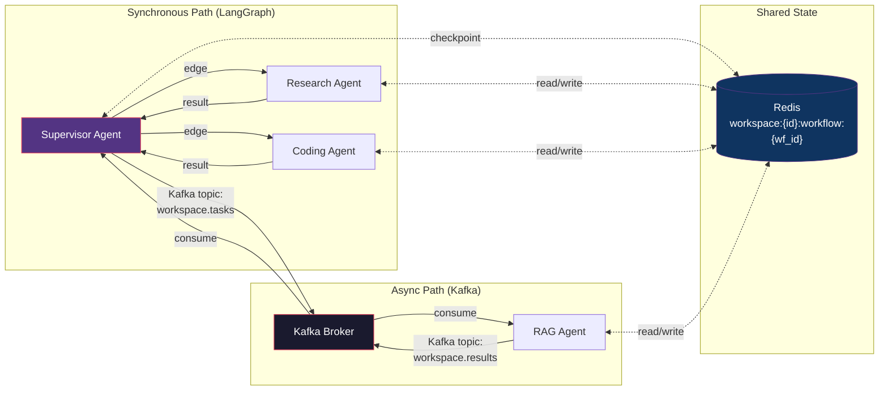
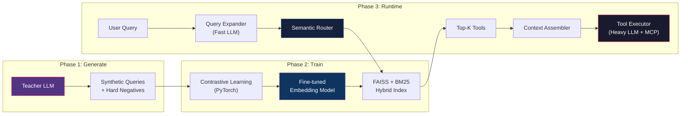
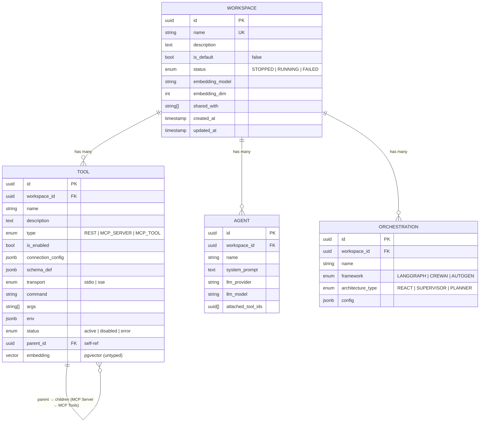

# SynapseForge

**A multi-tenant Agentic AI Platform that transforms tool routing from a brute-force problem into an intelligent, scalable architecture.**

SynapseForge evolves the standalone [NeuralToolRouter](#-the-neuralToolRouter-engine) into a comprehensive platform for building, managing, and orchestrating AI agents — with workspace isolation, containerised execution, and a built-in marketplace of pre-configured agents and tools.

<div align="center">


[](https://python.org)
[](https://fastapi.tiangolo.com)
[](https://angular.io)
[](https://github.com/pgvector/pgvector)
[](LICENSE)

</div>

---

## Table of Contents

- [Why SynapseForge?](#-why-synapseforge)
- [End-to-End Architecture](#-end-to-end-agentic-ai-architecture)
- [Core Differentiators](#-core-differentiators)
- [The NeuralToolRouter Engine](#-the-neuralToolRouter-engine)
- [Technology Stack](#-technology-stack)
- [Data Models](#-data-models)
- [Platform Features](#-platform-features)
- [Getting Started](#-getting-started)
- [API Reference](#-api-reference)
- [Example Applications](#-example-applications)
- [Performance Tuning](#-performance-tuning)
- [Roadmap](#-roadmap)
- [Contributing](#-contributing)
- [License](#-license)

---

## 🎯 Why SynapseForge?

Standard Agentic AI systems send **all** available tool schemas to the LLM on every request. As capabilities grow, this breaks down:

| Problem | Impact |
|---|---|
| **Context Window Bloat** | 100+ tool schemas = 10,000+ input tokens per call |
| **High Latency** | Larger context → slower Time-to-First-Token (TTFT) |
| **Exorbitant Costs** | Input token usage scales linearly with tool count |
| **Degraded Accuracy** | "Lost-in-the-middle" syndrome → misrouting & hallucination |

**SynapseForge solves this** with a "RAG-for-Tools" architecture — fine-tuned embedding models retrieve only the Top-K relevant tools per request, reducing context by **90%+** while improving accuracy.

### 📊 Measured Performance Gains

| Metric | Before | After SynapseForge |
|---|---|---|
| Context per request | 10,000+ tokens | 500–1,000 tokens |
| Response latency | Baseline | **1.5–4.5s faster** |
| API costs | Baseline | **~90% reduction** |
| Tool scalability | O(n) | **O(1)** via FAISS/ChromaDB |

---

## 🏗 End-to-End Agentic AI Architecture

SynapseForge separates concerns into a **Control Plane** (central management) and a **Data Plane** (isolated workspace execution), connected through shared infrastructure.



### Request Lifecycle



### Hybrid Mesh: Sync + Async Execution



---

## 🔑 Core Differentiators

### 1. NeuralToolRouter Middleware
Pre-evaluates every prompt to inject only the **Top-K relevant** tool schemas into the LLM context — reducing latency, cost, and hallucinations by 90%+.

### 2. Containerised Execution Environments
The platform acts as a **Control Plane**. Every user workspace runs in a dynamically provisioned, isolated Docker container with its own Agents, NeuralToolRouter model, and MCP Servers.

### 3. Default Workspace & Marketplace
A built-in repository of pre-configured Agents (Research, RAG, Coding) and MCP Tools that users can **clone** into their own custom workspaces — no configuration from scratch.

---

## 🧠 The NeuralToolRouter Engine

The core innovation powering SynapseForge — a three-phase pipeline that turns tool routing into a semantic search problem.



| Phase | What It Does | Output |
|---|---|---|
| **Generate** | Teacher LLM creates diverse synthetic queries per tool, with hard negatives | `synthetic_queries.jsonl` |
| **Train** | Contrastive learning fine-tunes an embedding model on your specific tools | Fine-tuned model + FAISS/BM25 index |
| **Runtime** | Hybrid retrieval (semantic + BM25) routes each query to the exact right tools | Top-K tool schemas injected into LLM context |

**Why fine-tuning matters:** Out-of-the-box embedding models fail to map abstract human requests to strict API terminology. Training on *your* tool definitions ensures domain-specific accuracy that zero-shot search cannot match.

---

## ⚙️ Technology Stack

| Layer | Technology | Purpose |
|---|---|---|
| **Control Plane** | Python 3.11+, FastAPI, SQLAlchemy (Async) | Central API, workspace management |
| **Frontend** | Angular (latest), IBM Carbon Design System | Enterprise-grade UI |
| **Primary Database** | PostgreSQL + pgvector | Configurations, embeddings, telemetry |
| **State & Cache** | Redis 7 | Shared state, LangGraph checkpoints |
| **Event Bus** | Confluent Kafka | Async agent choreography |
| **Embeddings** | PyTorch, sentence-transformers | Fine-tuned tool routing models |
| **Vector Search** | FAISS / ChromaDB + BM25 | Hybrid retrieval (dense + sparse) |
| **LLM Gateway** | LiteLLM | Vendor-agnostic (OpenAI, Anthropic, Google, Ollama) |
| **Tool Protocol** | Model Context Protocol (MCP) | Standardised tool/data connections |
| **Container Runtime** | Docker SDK (Python) | Per-workspace isolated environments |
| **Artifact Storage** | IBM Cloud Object Storage (COS) | Workspace-scoped artifact storage (datasets, models, indexes) with automatic local caching |
| **Observability** | OpenTelemetry, Langfuse | End-to-end trace propagation |

---

## 📦 Data Models

The PostgreSQL schema supports strict multi-tenant isolation via `workspace_id` foreign keys.



---

## 🚀 Platform Features

### Workspace Management & Cloning
- **Default Workspace** — System-level, read-only workspace with pre-built agents and tools
- **Custom Workspaces** — Users create private workspaces with full CRUD control
- **Resource Cloning** — Deep-copy agents, tools, and orchestrations from any workspace to another
- **Workspace Sharing** — Share workspaces with specific users via `shared_with` field

### Tool Registry (Unified MCP + REST)
- Register **REST APIs**, **MCP Servers** (stdio/SSE), and **individual MCP Tools**
- Automatic **tool discovery** — connect an MCP server, and its tools are auto-registered
- Hierarchical model — MCP Tools are children of their parent MCP Server
- **pgvector embeddings** — every tool gets embedded for semantic retrieval

### Agent Builder
- Define agents with system prompts, LLM provider/model, and attached tools
- NeuralToolRouter dynamically narrows attached tools to the most relevant subset per query

### Orchestration Engine
- Visual graph builder for multi-agent workflows
- Supports **LangGraph** (sync), **Kafka** (async), and hybrid topologies
- Framework-agnostic — swap between LangGraph, CrewAI, and AutoGen

### Environment Isolation (Docker Control Plane)
- **Start/Stop** containerised workspace environments from the UI
- Each container bundles: NeuralToolRouter weights, MCP servers, LangGraph engine
- Shared Redis state + Kafka event bus across containers

---

## 🏁 Getting Started

> See [QUICKSTART.md](QUICKSTART.md) for the detailed step-by-step guide.

### Quick Setup

```bash
# 1. Clone
git clone https://github.com/sinny777/synapse-forge.git
cd synapse-forge

# 2. Infrastructure (PostgreSQL + Redis)
docker compose --profile infra up -d

# 3. Backend
cd backend
python -m venv venv && source venv/bin/activate
pip install -r requirements.txt
cp .env.example .env   # Edit with your credentials & API keys

# 4. Reset database & seed default workspace
python -m setup.reset_db

# 5. Start the backend
python main.py          # → http://localhost:8000

# 6. Frontend (new terminal)
cd frontend
npm install && npm start  # → http://localhost:4200
```

### Schema Management

SynapseForge uses direct schema management (no Alembic) during rapid prototyping:

```bash
# Full reset: drop all tables → recreate → seed default workspace
python -m setup.reset_db

# Reset schema only (no seeding)
python -m setup.reset_db --no-seed

# Re-seed default workspace (idempotent)
python -m setup.seed_default_workspace

# Wipe & re-seed default workspace
python -m setup.seed_default_workspace --reset
```

The backend also auto-detects schema drift on startup (`DB_AUTO_RESET=true` in `.env`).

---

## 📡 API Reference

### Platform APIs

| Method | Endpoint | Description |
|---|---|---|
| `GET` | `/api/workspaces` | List all workspaces |
| `POST` | `/api/workspaces` | Create a new workspace |
| `GET` | `/api/workspaces/{id}` | Get workspace details |
| `PUT` | `/api/workspaces/{id}` | Update workspace |
| `DELETE` | `/api/workspaces/{id}` | Delete workspace |
| `GET` | `/api/workspaces/{id}/tools` | List tools in workspace |
| `POST` | `/api/workspaces/{id}/tools` | Register a tool |
| `GET` | `/api/workspaces/{id}/agents` | List agents in workspace |
| `POST` | `/api/workspaces/{id}/agents` | Create an agent |
| `GET` | `/api/workspaces/{id}/orchestrations` | List orchestrations |
| `POST` | `/api/workspaces/{id}/orchestrations` | Create orchestration |
| `POST` | `/api/router/predict` | Semantic tool retrieval (NeuralToolRouter) |

### Cloning & Import APIs

| Method | Endpoint | Description |
|---|---|---|
| `GET` | `/api/workspaces/default/agents` | List default workspace agents |
| `POST` | `/api/workspaces/{src}/clone-resource/{type}/{id}` | Clone a resource to another workspace |

### Docker Orchestration APIs (Planned)

| Method | Endpoint | Description |
|---|---|---|
| `POST` | `/api/workspaces/{id}/environment/start` | Spin up workspace container |
| `POST` | `/api/workspaces/{id}/environment/stop` | Tear down workspace container |
| `POST` | `/api/workspaces/{id}/execute` | Proxy execution to running container |

Interactive API docs: **http://localhost:8000/docs**

---

## 🧪 Example Applications

### LangGraph UHNW Private Banking

A LangGraph Supervisor coordinates 4 specialised agents (Portfolio, Tax, Market, Concierge) for ultra-high-net-worth banking:

```bash
cd examples/langgraph_UHNW_banking
python multi_agent_orchestrator.py --llm ollama --model granite4.1:8b
```

### IBM BeeAI Mediclaim Processing

An orchestrator coordinates 3 IBM BeeAgents (Policy, Billing, Claim) for medical insurance claim processing:

```bash
cd examples/beeai_mediclaim_processing
python multi_agent_orchestrator.py --llm ollama --model llama3
```

Both examples are instrumented with **Langfuse** for full observability. Add credentials to `.env`:

```bash
LANGFUSE_SECRET_KEY="sk-lf-..."
LANGFUSE_PUBLIC_KEY="pk-lf-..."
LANGFUSE_HOST="https://cloud.langfuse.com"
```

### Using NeuralToolRouter in Your Own Projects

Inject the fine-tuned model directly into any agent framework:

```python
from tool_router.config import config
from sentence_transformers import SentenceTransformer
from tool_router.runtime import SemanticRouter

# Load fine-tuned embedding model
model = SentenceTransformer(str(config.embedding.fine_tuned_model_dir))

# Initialise hybrid retrieval
router = SemanticRouter(model, config.vector_store)
router.load_faiss_index()
router.load_bm25_index()

# Retrieve only the relevant tools for a specific task
task = "Fetch the patient's hospital discharge summary"
top_tools = router.retrieve_tools(task, top_k=2, use_hybrid=True)

# Pass ONLY these tool schemas into your LangChain/AutoGen/BeeAI agent
```

---

## 🎛 Performance Tuning

Balance speed, accuracy, and cost with architectural dials:

| Optimise For | Configuration |
|---|---|
| **⚡ Speed** | `paraphrase-MiniLM-L3-v2`, Top-K=2, disable query expansion, `faiss-cpu` |
| **🎯 Accuracy** | `all-mpnet-base-v2`, Top-K=5, more training epochs, hybrid retrieval |
| **💰 Cost** | Local models via Ollama, swap expansion LLM to `gpt-4o-mini` |

---

## 📁 Project Structure

```
synapse-forge/
├── backend/                         # FastAPI Control Plane
│   ├── main.py                      # Application entry point
│   ├── api/                         # Route handlers
│   │   ├── workspaces.py            #   Workspace CRUD
│   │   ├── tools.py                 #   Tool registry + MCP discovery
│   │   ├── agents.py                #   Agent configuration
│   │   ├── orchestrations.py        #   Workflow definitions
│   │   ├── router.py                #   Semantic tool prediction
│   │   ├── auth.py                  #   Authentication
│   │   └── execute.py               #   Workflow execution
│   ├── db/
│   │   ├── engine.py                #   Async engine + drift detection
│   │   ├── models.py                #   ORM models (Workspace, Tool, Agent, Orchestration)
│   │   └── schemas.py               #   Pydantic v2 schemas
│   ├── services/
│   │   ├── embedding_service.py     #   Vector embedding generation
│   │   ├── mcp_service.py           #   MCP server lifecycle
│   │   └── router_service.py        #   Semantic routing logic
│   ├── setup/
│   │   ├── reset_db.py              #   Drop + recreate schema + seed
│   │   ├── seed_default_workspace.py#   Default workspace seeder
│   │   └── seed_master_data.py      #   Master MCP templates (via API)
│   ├── tool_router/                 #   NeuralToolRouter engine
│   └── requirements.txt
├── frontend/                        #   Angular + IBM Carbon UI
├── docker-compose.yml               #   PostgreSQL + Redis (infra profile)
├── docs/
│   └── platform/
│       └── PLATFORM_REQUIREMENTS_V2.md  #   Architecture spec
├── examples/
│   ├── langgraph_UHNW_banking/
│   └── beeai_mediclaim_processing/
└── infra/                           #   DB init scripts
```

---

## 🗺 Roadmap

### Execution Strategy

| Phase | Scope | Status |
|---|---|---|
| **Phase 1** | DB schema + Default Workspace templates + Seeding | ✅ Complete |
| **Phase 2** | Deep-copy cloning APIs (workspace → workspace) | 🔨 In Progress |
| **Phase 3** | Docker Control Plane — dynamic container start/stop per workspace | 📋 Planned |
| **Phase 4** | Agent Engine — LangGraph + Kafka hybrid execution inside containers | 📋 Planned |
| **Phase 5** | Frontend Marketplace — Default Workspace gallery, clone buttons, environment controls | 📋 Planned |
| **Phase 6** | Unified Builder — Visual drag-and-drop graph editor + OpenTelemetry trace viewer | 📋 Planned |

### Future Enhancements

- [ ] Active learning from user feedback loops
- [ ] Multi-modal tool descriptions (images, audio, video)
- [ ] Hierarchical tool routing (tool groups / namespaces)
- [ ] Streaming responses via WebSocket
- [ ] Multi-tenant RBAC with OAuth2 / OIDC
- [ ] Kubernetes deployment manifests (Helm charts)

---

## 🤝 Contributing

Contributions are welcome! See [CONTRIBUTING.md](CONTRIBUTING.md) for guidelines.

---

## 📄 License

MIT License — see [LICENSE](LICENSE) for details.

---

<div align="center">
  <br>
  <p><b>Connect with me</b></p>
  <a href="https://x.com/gurvinder_777"></a>
  <a href="https://www.linkedin.com/in/gurvindersingh777/"></a>
  <a href="https://github.com/sinny777"></a>
</div>

<div align="center">

**Built with ❤️ for the Agentic AI community by [Gurvinder Singh](https://github.com/sinny777)**

For issues and questions:
[GitHub Issues](https://github.com/sinny777/synapse-forge/issues) · [Architecture Docs](docs/platform/PLATFORM_REQUIREMENTS_V2.md) · [Quick Start](QUICKSTART.md)

</div>