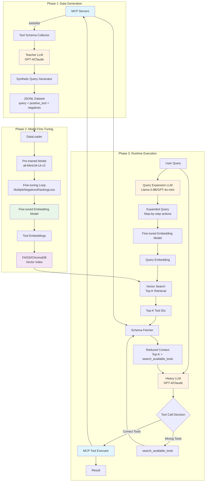

# ToolRouter - Reference Architecture

## Overview
ToolRouter is a compound AI system that optimizes agentic AI architectures by separating tool retrieval from parameter extraction and execution, reducing context window bloat and latency.

## System Architecture



## Architecture Components

### Phase 1: Synthetic Data Generation
**Purpose:** Generate high-quality training data for the embedding model.

**Components:**
1. **MCP Server Connector:** Connects to configured MCP servers and retrieves tool schemas via `tools/list` protocol
2. **Tool Schema Collector:** Aggregates and normalizes tool definitions (name, description, parameters)
3. **Teacher LLM:** Uses a powerful LLM (GPT-4, Claude) to generate diverse synthetic queries
4. **Query Generator:** Creates three types of queries:
   - Direct queries: Straightforward tool invocations
   - Implicit queries: Natural language that implies tool usage
   - Multi-tool queries: Complex requests requiring multiple tools
5. **Dataset Builder:** Outputs JSONL format with contrastive learning structure

**Output Format:**
```json
{
  "query": "What's the weather like in San Francisco?",
  "positive_tool_id": "weather_api.get_forecast",
  "hard_negative_tool_ids": ["calendar.get_events", "news.search"]
}
```

### Phase 2: Model Fine-Tuning
**Purpose:** Train a specialized embedding model for tool retrieval.

**Components:**
1. **DataLoader:** Loads and batches the synthetic JSONL dataset
2. **Base Model:** Starts with `all-MiniLM-L6-v2` (lightweight, fast)
3. **Training Loop:** 
   - Uses `MultipleNegativesRankingLoss` for contrastive learning
   - Optimizes for cosine similarity between queries and correct tools
   - Pushes negative tools away in embedding space
4. **Model Persistence:** Saves fine-tuned weights to `./models/fine_tuned_tool_router/`
5. **Index Builder:** Creates FAISS/ChromaDB vector index of all tool embeddings

**Key Advantages:**
- Fast inference (local PyTorch model)
- No API costs at runtime
- Adapts to your specific tool ecosystem

### Phase 3: Runtime Execution
**Purpose:** Process user requests with minimal context and maximum efficiency.

**Flow:**
1. **Query Expansion (Think First):**
   - User query → Fast LLM (Llama-3-8B, GPT-4o-mini)
   - LLM breaks down query into logical steps
   - Expanded query provides richer semantic signal

2. **Semantic Routing:**
   - Expanded query → Fine-tuned embedding model
   - Generate query embedding vector
   - Search FAISS index for Top-K most similar tools

3. **Context Assembly:**
   - Fetch full schemas ONLY for Top-K tools
   - Always include `search_available_tools` fallback
   - Dramatically reduced context size

4. **Heavy LLM Execution:**
   - Original query + reduced tool schemas → Heavy LLM
   - LLM decides which tool(s) to call with parameters
   - If tools are wrong, can call `search_available_tools`

5. **Tool Execution:**
   - Parse LLM response for tool calls
   - Execute via MCP protocol
   - Return results to user

## Key Architectural Patterns

### 1. RAG for Tools (Not Static Classification)
- Tools are embedded into vector space
- Runtime similarity search (not fixed classes)
- Easily add/remove tools without retraining
- Scales to hundreds of tools

### 2. LLM-Assisted Query Expansion
- Intercepts user query before embedding
- Fast LLM generates step-by-step breakdown
- Richer semantic signal for retrieval
- Improves recall for complex queries

### 3. Tool-Fetch Fallback
- `search_available_tools` always available
- Heavy LLM can self-correct
- Handles edge cases and ambiguous queries
- Graceful degradation

### 4. MCP Abstraction Layer
- Protocol-agnostic tool definitions
- Dynamic tool discovery
- Supports Stdio and SSE transports
- Standardized execution interface

## Performance Characteristics

### Context Window Reduction
- **Before:** All N tools in context (10K+ tokens)
- **After:** Top-K tools only (500-1000 tokens)
- **Savings:** 90%+ reduction for large tool sets

### Latency Optimization
- **Query Expansion:** ~200ms (fast LLM)
- **Embedding:** ~50ms (local PyTorch)
- **Vector Search:** ~10ms (FAISS)
- **Total Overhead:** ~260ms (vs. 0ms baseline)
- **Heavy LLM Savings:** 2-5 seconds (smaller context)
- **Net Improvement:** 1.5-4.5 seconds faster

### Cost Optimization
- **Embedding Model:** Free (local inference)
- **Query Expansion:** ~$0.0001 per query
- **Heavy LLM:** 90% fewer tokens = 90% cost reduction
- **ROI:** Pays for itself after ~100 queries

## Scalability

### Tool Scaling
- Linear growth in vector index size
- Sub-linear search time (FAISS optimization)
- Handles 1000+ tools efficiently

### Query Scaling
- Constant-time retrieval (Top-K fixed)
- Parallel query expansion possible
- Batch processing supported

## Extension Points

### Custom Embedding Models
- Swap base model in `config.py`
- Domain-specific pre-training
- Multi-lingual support

### Alternative Vector Stores
- FAISS (in-memory, fast)
- ChromaDB (persistent, scalable)
- Pinecone (cloud, managed)

### LLM Flexibility
- `litellm` supports 100+ providers
- Easy A/B testing
- Cost/performance optimization

## Security Considerations

### Tool Access Control
- MCP server authentication
- Tool-level permissions
- Audit logging

### Data Privacy
- Local embedding model (no data leakage)
- Configurable LLM providers
- On-premise deployment option

## Monitoring & Observability

### Key Metrics
- Retrieval accuracy (Top-K hit rate)
- Query expansion quality
- End-to-end latency
- Cost per query
- Tool execution success rate

### Logging
- Query → Expanded query
- Retrieved tools vs. executed tools
- Fallback invocations
- Error traces

## Future Enhancements

1. **Active Learning:** Collect user feedback to improve retrieval
2. **Multi-Modal Tools:** Support image/audio tool descriptions
3. **Hierarchical Routing:** Tool categories for faster search
4. **Caching Layer:** Memoize common query patterns
5. **Streaming Results:** Progressive tool execution