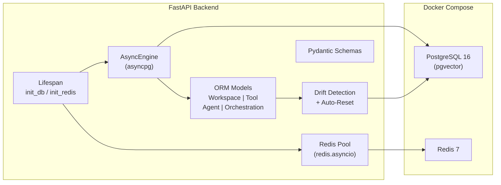

# Phase 1 & Phase 2 — Implementation Summary

## What Was Built

### Phase 1: Infrastructure & Database Connectivity

| File | Purpose |
|------|---------|
| [docker-compose.yml](file:///Users/gurvindersingh/Documents/development/repositories/neural-tool-router/docker-compose.yml) | PostgreSQL 16 (pgvector) + Redis 7 with health checks, persistent volumes, and env-driven credentials |
| [infra/init-db.sql](file:///Users/gurvindersingh/Documents/development/repositories/neural-tool-router/infra/init-db.sql) | Auto-runs `CREATE EXTENSION vector` on first container start |
| [db/engine.py](file:///Users/gurvindersingh/Documents/development/repositories/neural-tool-router/backend/db/engine.py) | Async SQLAlchemy engine (asyncpg), session factory, pgvector verification |
| [db/redis_pool.py](file:///Users/gurvindersingh/Documents/development/repositories/neural-tool-router/backend/db/redis_pool.py) | Async Redis connection pool with PING smoke-test |
| [main.py lifespan](file:///Users/gurvindersingh/Documents/development/repositories/neural-tool-router/backend/main.py#L24-L67) | FastAPI lifespan hooks wiring init/close for both DB & Redis |

### Phase 2: Data Models & Schemas

| File | Purpose |
|------|---------|
| [db/models.py](file:///Users/gurvindersingh/Documents/development/repositories/neural-tool-router/backend/db/models.py) | SQLAlchemy ORM: `Workspace`, `Tool` (with pgvector), `Agent`, `Orchestration` |
| [db/schemas.py](file:///Users/gurvindersingh/Documents/development/repositories/neural-tool-router/backend/db/schemas.py) | Pydantic v2 Create/Update/Read schemas + `RouterPredictRequest/Response` |

### Updated Files

| File | Change |
|------|--------|
| [requirements.txt](file:///Users/gurvindersingh/Documents/development/repositories/neural-tool-router/backend/requirements.txt) | Added `sqlalchemy[asyncio]`, `asyncpg`, `pgvector`, `redis` |
| [.env](file:///Users/gurvindersingh/Documents/development/repositories/neural-tool-router/backend/.env) | Added `POSTGRES_*` and `REDIS_*` connection variables |
| [.env.example](file:///Users/gurvindersingh/Documents/development/repositories/neural-tool-router/backend/.env.example) | Same + documentation comments |

---

## Architecture Diagram



---

## How to Use

### 1. Start Infrastructure
```bash
cd /Users/gurvindersingh/Documents/development/repositories/neural-tool-router
# If using existing PG + Redis containers, just configure backend/.env
# If starting fresh:
docker compose --profile infra up -d
```

### 2. Install Dependencies
```bash
cd backend
pip install -r requirements.txt
```

### 3. Start the FastAPI Server
```bash
uvicorn main:app --reload --host 0.0.0.0 --port 8000
```

Tables are **auto-created on startup** from ORM models (no migrations needed).
You should see:
```
🚀 Starting NeuralToolRouter platform services...
pgvector extension verified ✓
Database tables synced ✓
✅ PostgreSQL (pgvector) connected
✅ Redis connected
```

### Reset Database (Development Only)
To drop all tables and recreate from scratch:
```python
from db.engine import reset_db
await reset_db()  # ⚠️ DESTRUCTIVE — drops all data
```

---

## Data Model Summary

### Dynamic Embedding Dimensions (Per-Workspace)

Each workspace can choose its own embedding model and vector dimension. The `Tool.embedding` column uses an **untyped `vector`** (no fixed dimension constraint), so different workspaces can store 384-dim, 768-dim, 1536-dim vectors, etc. in the same table.

Since all queries filter by `workspace_id`, dimension consistency is guaranteed — pgvector enforces matching dimensions at query time.

| Embedding Model | Dimensions |
|-----------------|-----------|
| `sentence-transformers/all-MiniLM-L6-v2` (default) | 384 |
| `BAAI/bge-base-en-v1.5` | 768 |
| `BAAI/bge-large-en-v1.5` | 1024 |
| `OpenAI text-embedding-3-small` | 1536 |

> [!NOTE]
> **Trade-off:** Untyped vector columns cannot use HNSW/IVFFlat indexes. However, for tool routing scale (tens to hundreds of tools per workspace), exact nearest-neighbor search is sub-millisecond. Per-workspace partial HNSW indexes can be added later if needed.

### Table Schema

| Table | Key Columns | Notes |
|-------|-------------|-------|
| `workspaces` | `id` (UUID), `name`, `embedding_model`, `embedding_dim` | Root multi-tenant entity; owns embedding config |
| `tools` | `workspace_id` (FK), `type` (REST/MCP), `schema` (JSONB), `embedding` (untyped vector) | pgvector similarity search target; dimension set by workspace |
| `agents` | `workspace_id` (FK), `llm_provider`, `llm_model`, `attached_tool_ids` (UUID[]) | Agent definitions |
| `orchestrations` | `workspace_id` (FK), `framework` (enum), `architecture_type` (enum), `config` (JSONB) | Workflow graph definitions |

### Schema Management — Auto Drift Detection

No migration files needed. On every startup, `init_db()` compares ORM model columns against the live database:

| Scenario | What happens |
|----------|-------------|
| No drift (models match DB) | `Database tables synced ✓` — nothing changes |
| Drift detected + `DB_AUTO_RESET=true` | All tables are dropped and recreated from models (⚠️ data loss) |
| Drift detected + `DB_AUTO_RESET=false` | Warning logged, tables NOT altered — manual intervention needed |
| Brand-new table in models | Created automatically regardless of `DB_AUTO_RESET` |

**Drift detection checks:**
- New tables (exist in ORM but not in DB)
- Missing columns (exist in ORM model but not in DB table)
- Extra columns (exist in DB table but not in ORM model)

**Env var:** `DB_AUTO_RESET=true` (default, set in `.env`). Set to `false` in production.

**Dev workflow:** Change a model → restart the server → tables auto-reset. No commands needed.

> [!IMPORTANT]
> The FastAPI lifespan is designed to be **gracefully degradable** — if PostgreSQL or Redis aren't running, the app still starts (with warnings). This preserves backward compatibility with the existing file-based workflow.

### Docker Compose — Profiles

Both PostgreSQL and Redis services use `profiles: ["infra"]`, so they **don't start by default**. This avoids port conflicts with existing containers (e.g. `orby-postgres`, `my-redis`).

| Command | Effect |
|---------|--------|
| `docker compose up -d` | Starts nothing (no profiled services) |
| `docker compose --profile infra up -d` | Starts fresh PG (port 5433) + Redis (port 6380) |
| Configure `.env` to point to existing containers | Use existing PG/Redis without docker-compose |
