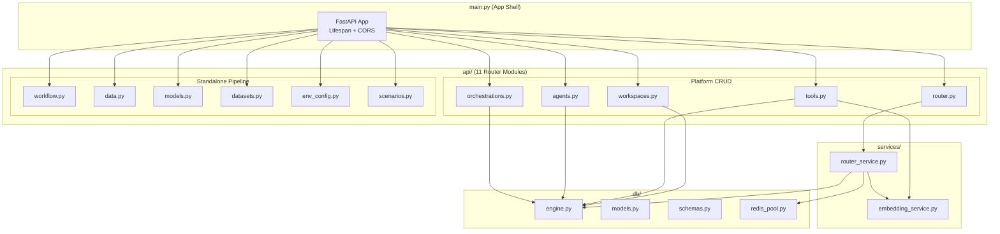

# Phase 3 & Phase 4 — Implementation Summary

## What Was Built

### Phase 3: Router Refactor (pgvector + Redis Caching)

| File | Purpose |
|------|---------|
| [services/__init__.py](file:///Users/gurvindersingh/Documents/development/repositories/neural-tool-router/backend/services/__init__.py) | Services package init |
| [services/embedding_service.py](file:///Users/gurvindersingh/Documents/development/repositories/neural-tool-router/backend/services/embedding_service.py) | Per-workspace embedding model loader with lazy caching. Generates dense vectors from `name • description • schema` for pgvector storage |
| [services/router_service.py](file:///Users/gurvindersingh/Documents/development/repositories/neural-tool-router/backend/services/router_service.py) | Platform-mode semantic router: pgvector cosine similarity search + Redis cache layer (`ntr:predict:{sha256}`, 5 min TTL) |

### Phase 4: API Restructuring + Platform CRUD

All route handlers extracted from `main.py` (823 → 133 lines) into focused modules:

| File | Tag | Routes | Purpose |
|------|-----|--------|---------|
| [api/workspaces.py](file:///Users/gurvindersingh/Documents/development/repositories/neural-tool-router/backend/api/workspaces.py) | Workspaces | 5 | `GET/POST/PUT/DELETE /api/workspaces` |
| [api/tools.py](file:///Users/gurvindersingh/Documents/development/repositories/neural-tool-router/backend/api/tools.py) | Tools | 5 | `CRUD /api/workspaces/{id}/tools` — auto-embeds on create/update |
| [api/agents.py](file:///Users/gurvindersingh/Documents/development/repositories/neural-tool-router/backend/api/agents.py) | Agents | 5 | `CRUD /api/workspaces/{id}/agents` |
| [api/orchestrations.py](file:///Users/gurvindersingh/Documents/development/repositories/neural-tool-router/backend/api/orchestrations.py) | Orchestrations | 5 | `CRUD /api/workspaces/{id}/orchestrations` |
| [api/router.py](file:///Users/gurvindersingh/Documents/development/repositories/neural-tool-router/backend/api/router.py) | Router | 1 | `POST /api/router/predict` — pgvector + Redis |
| [api/workflow.py](file:///Users/gurvindersingh/Documents/development/repositories/neural-tool-router/backend/api/workflow.py) | Workflow | 6 | Generate, Train, Run, Evaluate, Status |
| [api/data.py](file:///Users/gurvindersingh/Documents/development/repositories/neural-tool-router/backend/api/data.py) | Data | 3 | Synthetic data + tool cache |
| [api/models.py](file:///Users/gurvindersingh/Documents/development/repositories/neural-tool-router/backend/api/models.py) | Models | 3 | Model archive management |
| [api/datasets.py](file:///Users/gurvindersingh/Documents/development/repositories/neural-tool-router/backend/api/datasets.py) | Datasets | 4 | Dataset versioning |
| [api/env_config.py](file:///Users/gurvindersingh/Documents/development/repositories/neural-tool-router/backend/api/env_config.py) | Environment | 1 | LLM credentials from env vars |
| [api/scenarios.py](file:///Users/gurvindersingh/Documents/development/repositories/neural-tool-router/backend/api/scenarios.py) | Agent Scenarios | 3 | Standalone agent scenario execution |

### Updated Files

| File | Change |
|------|--------|
| [main.py](file:///Users/gurvindersingh/Documents/development/repositories/neural-tool-router/backend/main.py) | Rewritten as thin app shell (823 → 133 lines). Only lifespan, CORS, and `include_router()` calls |

---

## Architecture Diagram

---

## URL Path Preservation (Frontend Compatibility)

> [!IMPORTANT]
> **All URL paths are 100% preserved.** No frontend changes required. The refactoring only changes the backend code organization — the HTTP contract is identical.

| Frontend Service | Method | URL Path | Backend Module |
|---|---|---|---|
| `NeuralToolService` | `generate()` | `POST /api/generate` | `api/workflow.py` |
| `NeuralToolService` | `train()` | `POST /api/train` | `api/workflow.py` |
| `NeuralToolService` | `streamTrainingProgress()` | `GET /api/train/stream` | `api/workflow.py` |
| `NeuralToolService` | `run()` / `runStream()` | `POST /api/run` | `api/workflow.py` |
| `NeuralToolService` | `evaluate()` | `POST /api/evaluate` | `api/workflow.py` |
| `NeuralToolService` | `getStatus()` | `GET /api/status` | `api/workflow.py` |
| `NeuralToolService` | `getSyntheticData()` | `GET /api/data/synthetic` | `api/data.py` |
| `NeuralToolService` | `saveSyntheticData()` | `POST /api/data/synthetic` | `api/data.py` |
| `NeuralToolService` | `getCachedTools()` | `GET /api/data/tools` | `api/data.py` |
| `NeuralToolService` | `getModels()` | `GET /api/models` | `api/models.py` |
| `NeuralToolService` | `archiveModel()` | `POST /api/models/archive` | `api/models.py` |
| `NeuralToolService` | `deleteModel()` | `DELETE /api/models/{name}` | `api/models.py` |
| `NeuralToolService` | `getDatasets()` | `GET /api/datasets` | `api/datasets.py` |
| `NeuralToolService` | `archiveDataset()` | `POST /api/datasets/archive` | `api/datasets.py` |
| `NeuralToolService` | `loadDataset()` | `POST /api/datasets/load` | `api/datasets.py` |
| `NeuralToolService` | `deleteDataset()` | `DELETE /api/datasets/{name}` | `api/datasets.py` |
| `NeuralToolService` | `getAgentScenarios()` | `GET /api/agents/scenarios` | `api/scenarios.py` |
| `NeuralToolService` | `getAgentScenario()` | `GET /api/agents/scenarios/{id}` | `api/scenarios.py` |
| `NeuralToolService` | `executeAgentScenario()` | `POST /api/agents/execute` | `api/scenarios.py` |
| `LLMConfigService` | `initializeFromEnvironment()` | `GET /api/env/llm-credentials` | `api/env_config.py` |
| `LLMConfigComponent` | (direct call) | `GET /api/env/llm-credentials` | `api/env_config.py` |

---

## Verified Test Results

| Test | HTTP Code | Result |
|------|-----------|--------|
| `GET /api/status` | 200 | ✅ |
| `GET /api/data/synthetic` | 200 | ✅ |
| `GET /api/data/tools` | 200 | ✅ |
| `GET /api/models` | 200 | ✅ |
| `GET /api/datasets` | 200 | ✅ |
| `GET /api/env/llm-credentials` | 200 | ✅ |
| `GET /api/workspaces` | 200 | ✅ |
| `POST /api/router/predict` | 200 | ✅ |
| OpenAPI route count | 28 paths | ✅ |
| Swagger tag groups | 11 tags | ✅ |

---

## Next Phases

| Phase | Scope | Status |
|-------|-------|--------|
| Phase 1: Infrastructure & DB | docker-compose, engine, Redis pool | ✅ Complete |
| Phase 2: Data Models | ORM models, Pydantic schemas | ✅ Complete |
| **Phase 3: Router Refactor** | **pgvector search, Redis caching, embedding service** | **✅ Complete** |
| **Phase 4: API Routes + Restructure** | **CRUD endpoints, router predict, main.py refactor** | **✅ Complete** |
| Phase 5: Frontend Shell & Services | Angular + Carbon workspace switcher | 🔲 Pending |
| Phase 6: Frontend Views | Tool Registry, Agent Studio, Orchestrator Builder | 🔲 Pending |
| Phase 7: Observability UI | Playground chat + trace log (SSE) | 🔲 Pending |
